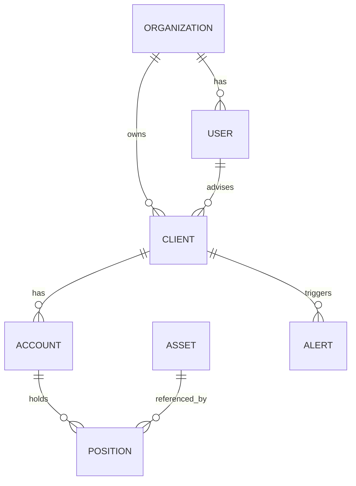
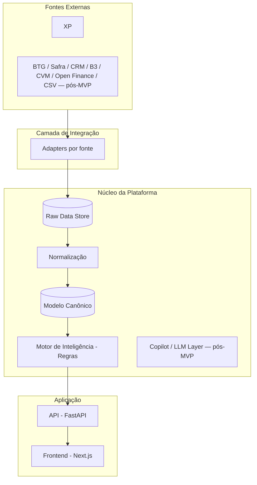

# Advisor Intelligence — Resumo Técnico do Projeto

## 1. Visão Geral do Produto

**Advisor Intelligence** é um SaaS B2B de **camada de inteligência** para assessores de investimento, escritórios de wealth management e assessores independentes no Brasil. O produto **não substitui** CRM, corretoras, consolidadores ou custodiantes — ele consome dados dessas fontes, normaliza tudo em um modelo canônico próprio, e gera alertas e insights priorizados.

**Princípio central do produto:**
> "Não mostre ao assessor o que está acontecendo. Diga o que merece atenção e por quê."

**Princípio de execução do MVP:**
> "O sistema deve transformar dados financeiros e de relacionamento fragmentados em ações priorizadas e explicáveis para o assessor."

Prioridades de engenharia, nessa ordem: **simplicidade → confiabilidade → explicabilidade → extensibilidade → escalabilidade**.

---

## 2. Escopo do MVP (o que foi decidido construir primeiro)

O desenho completo do produto prevê 5 casos de uso principais (Today Dashboard, Client 360, Advisor Copilot com IA, Propensity/Opportunity Engine, Interaction Intelligence via CRM) e uma arquitetura de integração com múltiplas fontes (XP, BTG, Safra, CRM, B3, CVM, Open Finance, CSV).

**Para o MVP, o escopo foi deliberadamente reduzido:**

| Dimensão | Decisão do MVP |
|---|---|
| Fonte de dados | **Somente XP**, via API (não CSV) |
| Caso de uso | **Today Dashboard + Motor de Alertas** (wedge inicial) |
| Regras de alerta | 3-4 regras simples: caixa ociosa, concentração, movimentação relevante, (opcional) vencimento próximo |
| Client 360 | Versão simplificada: cadastro + posições + alertas, sem histórico comportamental nem suitability avançado |
| Copilot / IA | **Fora do MVP** — fica para depois de validar tração |
| Propensity Engine | **Fora do MVP** |
| CRM / Interaction Intelligence | **Fora do MVP** |
| Client Master Data (resolução de identidade multi-fonte) | **Desnecessário no MVP** — com uma única fonte, `xp_client_id` já é a chave |

**Racional da priorização:** validar o problema com 5-10 assessores antes de codar, escolher um único wedge de valor (alertas), entrar pela fonte de dados mais simples tecnicamente, e só investir em IA/Propensity depois de tração real com pilotos — essas partes são as mais caras e dependem de dados de uso reais para calibrar.

---

## 3. Stack Tecnológica

```
Frontend:          Next.js + React + TypeScript (App Router)
Backend:            Python + FastAPI
Banco de dados:     PostgreSQL (gerenciado via Railway)
ORM/Migrations:     SQLAlchemy + Alembic
Jobs assíncronos:   Celery + Redis (sync periódico com a XP)
Autenticação:       Clerk (multi-tenant nativo via Organizations)
Hosting backend:    Railway
Hosting frontend:   Vercel
CI/CD:              GitHub Actions (testes/lint; deploy é auto via Railway/Vercel a partir do GitHub)
```

Decisões explícitas de **não fazer** no MVP: sem Kubernetes, sem microsserviços, sem Kafka, sem Data Mesh, sem infraestrutura de ML complexa — um backend monolítico bem modularizado é suficiente para essa fase.

---

## 4. Integração com a XP

- A XP possui um developer portal (`developer.xpinc.com`) com APIs para parceiros cobrindo posição, conta, movimentação, produto e comissão, incluindo sandbox.
- **Ponto de atenção crítico:** o acesso normalmente não é self-serve — exige credenciamento como parceiro/escritório, processo que pode ter componente comercial/jurídico além do técnico, e costuma ser o maior risco de cronograma do projeto (mais que o código em si).
- **Estratégia recomendada:** iniciar o processo de credenciamento em paralelo ao desenvolvimento, construindo o resto do sistema contra dados mockados no formato esperado da API, e plugando o adapter real assim que o acesso for liberado.

### Fluxo de sincronização (desenhado, ainda não implementado)
```
Job agendado (Celery Beat)
    → Autenticação OAuth2 na API XP
    → Fetch: clientes, contas, posições
    → Mapear payload XP → modelo canônico
    → Upsert em Client/Account/Position
    → Motor de regras roda sobre os dados atualizados
    → Alert table
```

---

## 5. Modelo de Dados Canônico (MVP)

Versão reduzida do modelo completo do produto — 7 entidades, sem CRM, suitability, propensity ou resolução de identidade multi-fonte (desnecessária com fonte única).



**Tabelas e campos principais:**

```sql
organizations(id, name)

users(id, org_id, email, role)  -- role: "admin" | "advisor"

clients(id, org_id, advisor_id, xp_client_id, name, aum, last_synced_at)

accounts(id, client_id, xp_account_id, account_type)

assets(id, ticker, asset_class)

positions(id, account_id, asset_id, quantity, market_value, position_date)

alerts(id, client_id, alert_type, severity, explanation, status, created_at)
```

**Nota:** todas as tabelas de negócio carregam (ou herdam via FK) `org_id`, garantindo isolamento multi-tenant. No MVP, esse isolamento é feito por **filtro na camada de aplicação**, não por row-level security no Postgres — RLS fica para quando o número de organizações crescer.

### Modelo canônico completo (visão de produto, pós-MVP)
Para referência futura, o desenho completo do produto prevê entidades adicionais: `Advisor`, `Issuer`, `Transaction`, `PortfolioSnapshot`, `Interaction`, `Suitability`, `ClientPreference`, `MarketEvent`, `Opportunity`, `PropensityScore`, `Task`, e uma tabela de `source_identity_map` para reconciliar identidade entre múltiplas fontes (XP, BTG, CRM) quando o produto evoluir para múltiplos distribuidores.

---

## 6. Arquitetura de Sistema (visão completa do produto)



**Princípio arquitetural chave:** nenhuma fonte externa é consumida diretamente pela aplicação — tudo passa por normalização antes de virar dado canônico. O motor de inteligência (regras explicáveis no V1) fica entre os dados e a interface, e futuramente entre os dados e o Copilot de IA.

**Governança de IA (desenho futuro, não implementado no MVP):** o LLM nunca teria acesso direto ao banco. O fluxo seria `Linguagem Natural → Intent Parser → Query Builder → Camada de Dados Estruturada → Motor de Inteligência → Contexto → LLM → Resposta Explicável`, evitando alucinação de dados financeiros.

---

## 7. Motor de Alertas (regras do MVP)

Implementado como funções puras e testáveis, rodando via Celery após cada sincronização:

1. **Caixa ociosa** — `asset_class = 'caixa/liquidez'` acima de um % do AUM do cliente.
2. **Concentração** — uma posição representando mais de X% do AUM do cliente.
3. **Movimentação relevante** — variação de AUM total acima de X% desde o último snapshot.
4. *(opcional, se o dado estiver disponível na API)* **Vencimento próximo** — ativos de renda fixa vencendo nos próximos N dias.

Estrutura de cada alerta gerado:
```
alert_type, severity, client, asset (opcional), explanation, source, created_at, status
```

Regras que dependem de fontes ainda não integradas (CRM, eventos de mercado) — sem contato há X dias, evento de mercado relevante, mudança de alocação por classe — ficam para quando essas fontes entrarem no roadmap.

---

## 8. Estrutura de Pastas (Monorepo)

```
advisor-intelligence/
├── backend/
│   ├── app/
│   │   ├── main.py
│   │   ├── config.py          # pydantic-settings, lê variáveis de ambiente
│   │   ├── database.py        # engine SQLAlchemy, Base declarativa
│   │   ├── celery_app.py      # config do Celery + beat schedule
│   │   ├── models/
│   │   │   ├── __init__.py    # importa todos os models (necessário p/ Alembic)
│   │   │   ├── organization.py
│   │   │   ├── user.py
│   │   │   ├── client.py
│   │   │   ├── account.py
│   │   │   ├── asset.py
│   │   │   ├── position.py
│   │   │   └── alert.py
│   │   └── routers/
│   │       ├── clients.py
│   │       └── alerts.py
│   ├── alembic/
│   │   └── env.py
│   ├── alembic.ini
│   ├── requirements.txt
│   ├── Procfile               # web: uvicorn app.main:app --host 0.0.0.0 --port $PORT
│   └── .env                   # nunca commitado (.gitignore)
├── frontend/
│   ├── app/
│   │   ├── layout.tsx          # envolvido por <ClerkProvider>
│   │   ├── page.tsx
│   │   └── globals.css
│   ├── middleware.ts           # clerkMiddleware() — protege rotas
│   ├── package.json
│   └── .env.local
└── .github/workflows/
    └── backend.yml
```

---

## 9. Autenticação e Multi-tenancy

- **Clerk** cuida do login (email/senha ou magic link) e tem suporte nativo a **Organizations**, usado para modelar `org_id` sem construir isso manualmente.
- **Frontend:** `ClerkProvider` envolvendo o app + `middleware.ts` com `clerkMiddleware()` protegendo rotas — **já implementado e funcional**.
- **Backend:** variável `CLERK_SECRET_KEY` existe no `config.py`, mas **a validação do JWT ainda não foi implementada** — a API atualmente aceita requisições sem checar autenticação. Este é um item pendente identificado explicitamente, com prioridade antes de expor a API além do ambiente de desenvolvimento.
- **Papéis planejados:** `admin` (gerencia integrações e vê todos os clientes da org) e `advisor` (vê só seus próprios clientes).
- **Isolamento multi-tenant:** por `org_id` filtrado na camada de serviço (RLS do Postgres fica para uma fase posterior).

---

## 10. API — Endpoints Definidos

```
GET    /health
GET    /clients/
GET    /alerts/
POST   /copilot/query            (desenho futuro, não implementado)
GET    /integrations             (desenho futuro, não implementado)
```

Os routers de `clients` e `alerts` existem hoje como placeholders (`return []`), aguardando implementação de queries reais contra o modelo canônico.

---

## 11. Segurança e Compliance (considerações de produto, para quando o volume de dados reais aumentar)

- LGPD: base legal para tratamento de dados de clientes finais, minimização de dados enviados a qualquer LLM futuro.
- Criptografia em trânsito (TLS) e em repouso.
- RBAC + isolamento por organização.
- Audit logs de ações sensíveis.
- Segredos nunca commitados — `.env` no `.gitignore`, variáveis reais só no painel do provedor (Railway/Vercel).
- Separação conceitual entre: dados financeiros, dados pessoais, inteligência derivada, e conteúdo gerado por IA.

---

## 12. Status Atual da Implementação

✅ **Concluído:**
- Repositório estruturado como monorepo (`backend/` + `frontend/`).
- Backend FastAPI rodando, com `/health`, `/clients/`, `/alerts/` (placeholders).
- Modelo canônico mínimo (7 tabelas) migrado com sucesso no Postgres de produção via Alembic.
- Banco Postgres e Redis provisionados no Railway.
- Deploy do backend funcionando no Railway (com `Procfile`, `requirements.txt` correto, variáveis de ambiente configuradas).
- Deploy do frontend funcionando na Vercel, com `NEXT_PUBLIC_API_URL` apontando corretamente para o backend (incluindo protocolo `https://`).
- Frontend e backend conversando de ponta a ponta em produção (confirmado via página de teste consumindo `/health`).
- Clerk integrado e funcional no frontend (login e proteção de rotas).

⬜ **Pendente:**
- Validação do JWT do Clerk no backend (`get_current_user` dependency) — API hoje está aberta sem autenticação real.
- CORS configurado no FastAPI (adicionado durante o troubleshooting de deploy, confirmar se está ativo).
- Adapter de integração com a XP (aguardando processo de credenciamento como parceiro).
- Implementação real das queries em `/clients` e `/alerts` (hoje retornam listas vazias).
- Motor de regras (as 3-4 regras de alerta).
- Telas de fato: Today Dashboard, lista de Clientes, Client 360, tela de Integrações.
- Pre-Deploy Command no Railway para rodar `alembic upgrade head` automaticamente a cada deploy (hoje feito manualmente via `railway ssh`).
- Celery worker e beat configurados e rodando (código existe, mas não confirmado como deployado/ativo).

---

## 13. Principais Lições de Troubleshooting (para referência futura)

Durante o setup, uma classe recorrente de erro foi **ambiente Python errado sendo usado** (venv local vs. Python global vs. venv do container) — causando `ModuleNotFoundError` mesmo com pacotes "instalados". Padrão de diagnóstico que funcionou:
- Sempre confirmar com `pip show <pacote>` e `python -c "import X; print(X.__file__)"` antes de assumir que uma reinstalação vai resolver.
- No Windows, usar `venv\Scripts\activate` (não `source venv/bin/activate`, que é sintaxe Unix).
- Dentro de containers Railway, usar caminhos completos (`/app/.venv/bin/python`) para evitar ambiguidade com o Python do sistema.
- Cuidado com pastas locais (`alembic/`) conflitando com nomes de bibliotecas instaladas quando rodando comandos do diretório errado.

Outra classe de erro foi **URLs internas vs. públicas do Railway** (`postgres.railway.internal` só funciona de dentro da rede privada do Railway; para acesso local, é necessário TCP Proxy ou `railway ssh`/`railway run`).

E por fim, erros de **variáveis de ambiente incompletas ou mal formatadas** (falta de protocolo `https://`, sintaxe de template `${{...}}` não resolvida fora do contexto certo, `requirements.txt` gerado com o venv errado ativo) foram a causa mais comum de falhas de deploy tanto no Railway quanto na Vercel.
